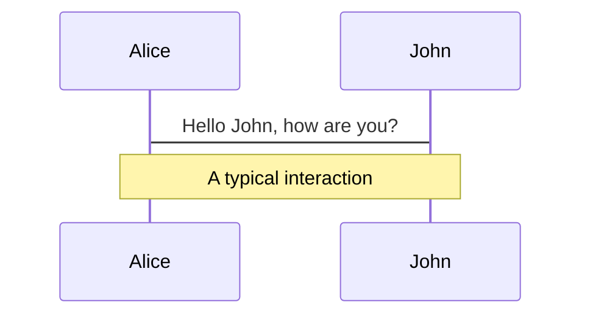

# Layouts CenterImage.vue

<!--
The last comment block of each slide will be treated as slide notes. It will be visible and editable in Presenter Mode along with the slide. [Read more in the docs](https://sli.dev/guide/syntax.html#notes)
-->

---
layout: LeftRightImage
leftImage: https://source.unsplash.com/umLAzmGNZbU/960x960
rightImage: https://source.unsplash.com/WNS__aBJjl4/960x960
---

# Layouts LeftRightImage.vue

---
layout: TopBottomImage
topImage: https://source.unsplash.com/umLAzmGNZbU/1920x480
bottomImage: https://source.unsplash.com/WNS__aBJjl4/1920x480
---

# Layouts TopBottomImage.vue

---
layout: RightImage
image: https://source.unsplash.com/umLAzmGNZbU/960x960
---

# Layouts
## RightImage.vue

- 🎨 **Various Layouts** - various pre-installed layouts

```yaml
---
# layout: <- [Layout vue component name]
layout: RightImage
# image: <- input that RightImage.vue needs
image: https://source.unsplash.com/umLAzmGNZbU/960x960
---
```

---
layout: CoverRight
image: https://source.unsplash.com/umLAzmGNZbU/960x960
---

# Layouts CoverRight.vue
### Code Area Sample

Use code snippets and get the highlighting directly![^1]

```ts {all|2|1-6|9|all}
interface User {
  id: number
  firstName: string
  lastName: string
  role: string
}

function updateUser(id: number, update: User) {
  const user = getUser(id)
  const newUser = { ...user, ...update }
  saveUser(id, newUser)
}
```

<arrow v-click="3" x1="400" y1="500" x2="260" y2="370" color="#4a40be" width="3" arrowSize="1" />

[^1]: [Learn More](https://sli.dev/guide/syntax.html#line-highlighting)

<style>
.footnotes-sep {
  @apply mt-5 opacity-10;
}
.footnotes {
  @apply text-sm opacity-75;
}
.footnote-backref {
  display: none;
}
</style>

---
layout: LeftImage
image: https://source.unsplash.com/WNS__aBJjl4/960x960
---

# Layouts LeftImage.vue
### Keyboard Shortcuts

|     |     |
| --- | --- |
| <kbd>right</kbd> / <kbd>space</kbd>| next animation or slide |
| <kbd>left</kbd>  / <kbd>shift</kbd><kbd>space</kbd> | previous animation or slide |
| <kbd>up</kbd> | previous slide |
| <kbd>down</kbd> | next slide |

---
layout: CoverLeft
image: https://source.unsplash.com/WNS__aBJjl4/960x960
---

# Layouts CoverLeft.vue
### Mermaid Diagrams

You can create diagrams / graphs from textual descriptions, directly in your Markdown.



[Learn More](https://sli.dev/guide/syntax.html#diagrams)

---
layout: Column2
---

::title::
# Layouts Column2.vue

::left::
## Left Cloumn slot
### LaTeX

LaTeX is supported out-of-box powered by [KaTeX](https://katex.org/).

Inline $\sqrt{3x-1}+(1+x)^2$

::right::
## Right Cloumn slot
### LaTex

Block
$$
\begin{array}{c}

\nabla \times \vec{\mathbf{B}} -\, \frac1c\, \frac{\partial\vec{\mathbf{E}}}{\partial t} &
= \frac{4\pi}{c}\vec{\mathbf{j}}    \nabla \cdot \vec{\mathbf{E}} & = 4 \pi \rho \\

\nabla \times \vec{\mathbf{E}}\, +\, \frac1c\, \frac{\partial\vec{\mathbf{B}}}{\partial t} & = \vec{\mathbf{0}} \\

\nabla \cdot \vec{\mathbf{B}} & = 0

\end{array}
$$

[Learn more](https://sli.dev/guide/syntax#latex)

---
layout: Column2Center
---

::title::
# Layouts Column2Center.vue

::left::
## Left Cloumn slot
### Left Cloumn slot
- this is left slot

::right::
## Right Cloumn slot
### Right Cloumn slot
- this is right slot

---
layout: Column3
---

::title::
# Layouts Column3.vue

::left::
## Left Cloumn slot
### Tweet Component

<div class="grid place-items-center grid-cols-1 grid-rows-1">
  <Transform :scale="0.65" origin="top center">
    <Tweet id="1390115482657726468"/>
  </Transform>
</div>

::center::
## Center Cloumn slot
### Center Cloumn slot

```html
<Tweet id="1390115482657726468"/>
```

```html
<Youtube id="eW7v-2ZKZOU" />
```

::right::
## Right Cloumn slot
### Youtube Component

<div class="grid place-items-center grid-cols-1 grid-rows-1">
  <Transform :scale="0.9" origin="center">
    <Youtube id="eW7v-2ZKZOU" />
  </Transform>
</div>
---
layout: Column3Center
---

::title::
# Layouts Column3Center.vue

::left::
## Left Cloumn slot
### Left Column slot
- left

::center::
## Center Cloumn slot
### Center Cloumn slot
- center

::right::
## Right Cloumn slot
### Right Cloumn slot
- right

---
layout: Square4
---

::title::
# Layouts Square4.vue

::topLeft::
## TopLeft Cloumn slot
### TopLeft Cloumn slot

::topRight::
## TopRight Cloumn slot
### TopRight Cloumn slot

::bottomLeft::
## BottomLeft Cloumn slot
### BottomLeft Cloumn slot

::bottomRight::
## BottomRight Cloumn slot
### BottomRight Cloumn slot

---
layout: Square4Center
---

::title::
# Layouts Square4Center.vue

::topLeft::
## TopLeft Cloumn slot
### TopLeft Cloumn slot
- TopLeft

::topRight::
## TopRight Cloumn slot
### TopRight Cloumn slot
- TopRight

::bottomLeft::
## BottomLeft Cloumn slot
### BottomLeft Cloumn slot
- BottomLeft

::bottomRight::
## BottomRight Cloumn slot
### BottomRight Cloumn slot
- BottomRight

---
layout: CoverRight
image: https://source.unsplash.com/umLAzmGNZbU/960x960
---

# About Slidev

<p>
Slidevook is powered by Slidev, the most amazing OSS!<br/>
By learning about Slidev, you can create more versatile slides!<br/>
The following links will help you learn Slidev
</p>

[Why Slidev?](https://sli.dev/guide/why)
<br/><br/>
[Slidev Doc](https://sli.dev)
<br/><br/>
[Slidev GitHub](https://github.com/slidevjs/slidev)
